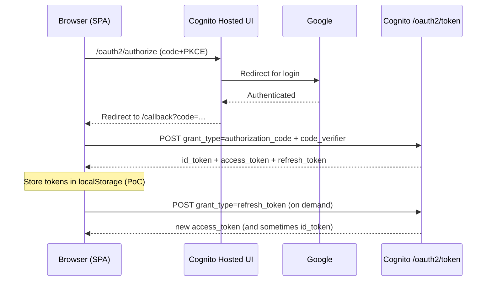

# Refresh tokens in this repo (PoC vs production)

This repo implements a **simple refresh-on-demand** approach for learning purposes.

---

## PoC approach (implemented here)

- Tokens are stored in **localStorage**:
  - `id_token`
  - `access_token`
  - `refresh_token`
- The app refreshes when access token is expiring soon:
  - Event: `[:auth/ensure-fresh]`
  - Manual button: **Force refresh**

### Security warning

Storing refresh tokens in any JS-accessible storage (localStorage/sessionStorage) increases exposure to **XSS**.

This is acceptable for a tutorial/PoC, but not ideal for production.

---

## Production path (recommended)

Use a small **Backend-for-Frontend (BFF)** (e.g., API Gateway + Lambda) to keep refresh tokens server-side:

- SPA performs PKCE login
- SPA sends `code` + `code_verifier` to the backend
- Backend exchanges code for tokens, stores refresh token server-side
- Backend sets a **Secure, HttpOnly cookie** (session id)
- SPA calls backend endpoints to obtain short-lived access tokens as needed

This prevents refresh tokens from ever being readable by browser JavaScript.

---

## Mermaid diagram (PoC flow)



---

## Mermaid diagram (Production/BFF concept)

```mermaid
sequenceDiagram
  participant B as Browser (SPA)
  participant C as Cognito Hosted UI
  participant F as BFF (API Gateway + Lambda)
  participant T as Cognito /oauth2/token
  participant D as DynamoDB (session store)

  B->>C: /oauth2/authorize (code+PKCE)
  C-->>B: Redirect to /callback?code=...
  B->>F: POST /session/exchange {code, code_verifier}
  F->>T: POST /oauth2/token (authorization_code)
  T-->>F: tokens (incl refresh_token)
  F->>D: Store refresh_token keyed by session id
  F-->>B: Set-Cookie: session=...; HttpOnly; Secure
  B->>F: POST /session/tokens (cookie)
  F->>T: POST /oauth2/token (refresh_token)
  T-->>F: new access_token
  F-->>B: access_token (short-lived)
```
