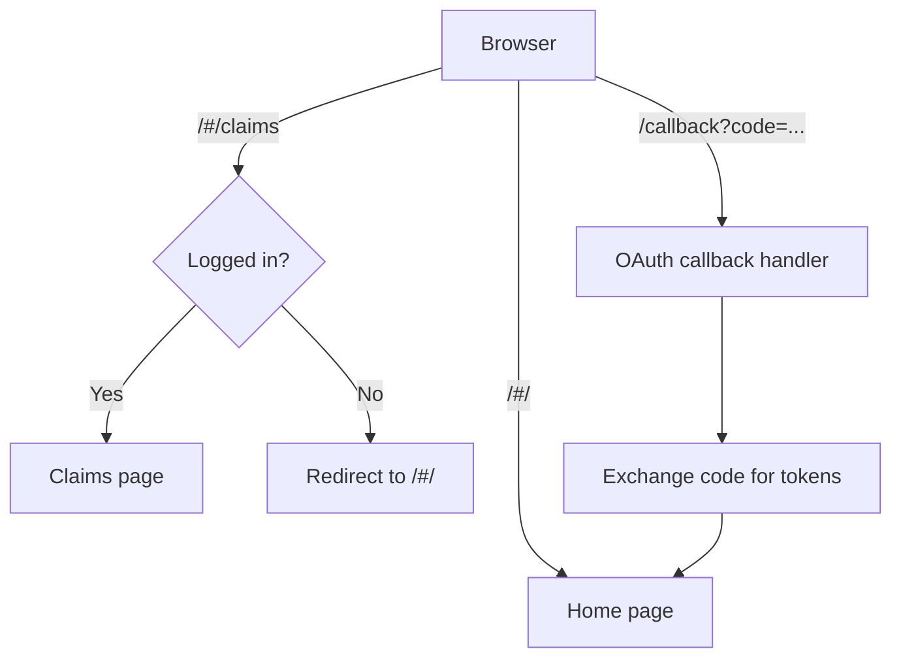

## Routing + OAuth flow (diagram)

```mermaid
flowchart TD
    A[Browser] -->|/#/| H[Home page]
    A -->|/#/claims| G{Logged in?}
    G -->|Yes| C[Claims page]
    G -->|No| R[Redirect to /#/]

    A -->|/callback?code=...| CB[OAuth callback handler]
    CB --> T[Exchange code for tokens]
    T --> H
```
